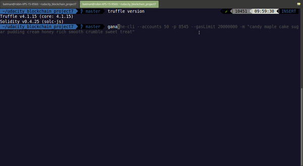
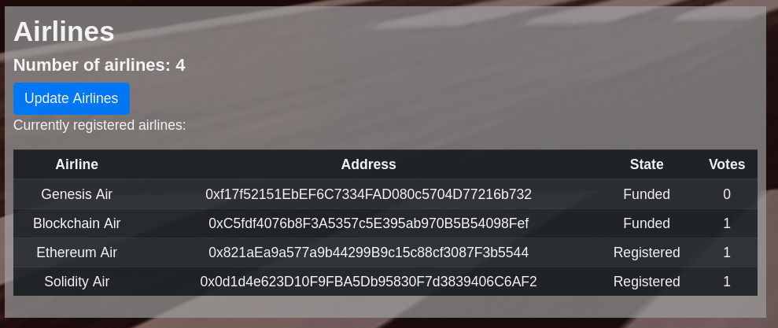
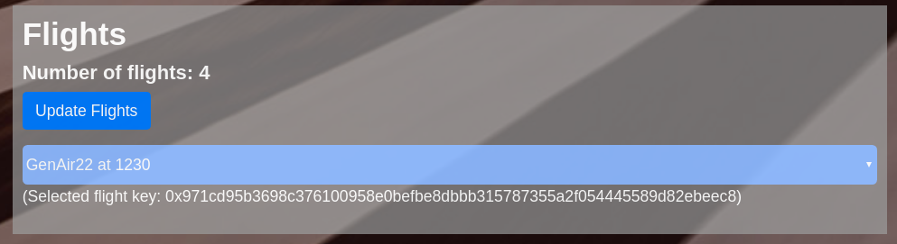

# Flight Surety project - overview


## Quickstart

Confirm versions of Truffle and Solidity compiler;
```
truffle(develop)> version
Truffle v4.1.15 (core: 4.1.15)
Solidity v0.4.25 (solc-js)
```

`ganache-cli --accounts 50 -p 8545 --gasLimit 20000000 -m "candy maple cake sugar pudding cream honey rich smooth crumble sweet treat"`

`truffle compile`

`truffle migrate`

`npm run server`

`npm run dapp`

`visit http://localhost:8000`

## (Test results)





```
 ~/udacity_blockchain_project7   master  truffle test                                   ✔  10423  15:15:05  INSERT
Using network 'development'.

	testOracles.js: oracles.js: Initiating contract


  Contract: Airline Tests
    ✓ First airline is registered when contract is deployed
    ✓ Only existing airline may register a new airline until there are at least four airlines registered (338ms)
    ✓ Registration of fifth and subsequent airlines requires multi-party consensus of 50% of registered airlines (266ms)
    ✓ Airline can be registered, but does not participate in contract until it submits funding of 10 ether (55ms)

  Contract: Flight Tests
	testFlights.js: First airline: name=Genesis Air, address=0xf17f52151ebef6c7334fad080c5704d77216b732, state=1, votes=0
	testFlights.js: FlightRegistered key: 0xebf71c7f638412fbe127c21b2af20134c4e70093eb1811cd8e15cb64ae795700 by: 0xf17f52151ebef6c7334fad080c5704d77216b732
	testFlights.js: A111,true,0,1000,0xf17f52151ebef6c7334fad080c5704d77216b732
    ✓ Register a flight (91ms)
    ✓ Update flight status
    ✓ Triggers an oracle response (67ms)

  Contract: Oracles
	testOracles.js: Oracle accounts: 9
	testOracles.js: Oracle Registered, three indices assigned: 8, 0, 2
	testOracles.js: Oracle Registered, three indices assigned: 0, 6, 5
	testOracles.js: Oracle Registered, three indices assigned: 7, 4, 9
	testOracles.js: Oracle Registered, three indices assigned: 0, 4, 6
	testOracles.js: Oracle Registered, three indices assigned: 1, 2, 0
	testOracles.js: Oracle Registered, three indices assigned: 9, 5, 2
	testOracles.js: Oracle Registered, three indices assigned: 4, 3, 2
	testOracles.js: Oracle Registered, three indices assigned: 3, 9, 6
	testOracles.js: Oracle Registered, three indices assigned: 2, 0, 9
    ✓ can register oracles (1053ms)
OracleRequest:
{ index: BigNumber { s: 1, e: 0, c: [ 3 ] },
  airline: '0xf17f52151ebef6c7334fad080c5704d77216b732',
  flight: 'ND1309',
  timestamp: BigNumber { s: 1, e: 9, c: [ 1559826914 ] } }
	testOracles.js: Oracle 0x69e1cb5cfca8a311586e3406ed0301c06fb839a2 on 8,0,2
	testOracles.js: 	Error on index 0 8 ND1309 1559826914
	testOracles.js: 	Error on index 1 0 ND1309 1559826914
	testOracles.js: 	Error on index 2 2 ND1309 1559826914
	testOracles.js: Oracle 0xf014343bdffbed8660a9d8721dec985126f189f3 on 0,6,5
	testOracles.js: 	Error on index 0 0 ND1309 1559826914
	testOracles.js: 	Error on index 1 6 ND1309 1559826914
	testOracles.js: 	Error on index 2 5 ND1309 1559826914
	testOracles.js: Oracle 0x0e79edbd6a727cfee09a2b1d0a59f7752d5bf7c9 on 7,4,9
	testOracles.js: 	Error on index 0 7 ND1309 1559826914
	testOracles.js: 	Error on index 1 4 ND1309 1559826914
	testOracles.js: 	Error on index 2 9 ND1309 1559826914
	testOracles.js: Oracle 0x9bc1169ca09555bf2721a5c9ec6d69c8073bfeb4 on 0,4,6
	testOracles.js: 	Error on index 0 0 ND1309 1559826914
	testOracles.js: 	Error on index 1 4 ND1309 1559826914
	testOracles.js: 	Error on index 2 6 ND1309 1559826914
	testOracles.js: Oracle 0xa23eaef02f9e0338eecda8fdd0a73add781b2a86 on 1,2,0
	testOracles.js: 	Error on index 0 1 ND1309 1559826914
	testOracles.js: 	Error on index 1 2 ND1309 1559826914
	testOracles.js: 	Error on index 2 0 ND1309 1559826914
	testOracles.js: Oracle 0xc449a27b106be1120bd1fd62f8166a2f61588eb9 on 9,5,2
	testOracles.js: 	Error on index 0 9 ND1309 1559826914
	testOracles.js: 	Error on index 1 5 ND1309 1559826914
	testOracles.js: 	Error on index 2 2 ND1309 1559826914
	testOracles.js: Oracle 0xf24ae9ce9b62d83059bd849b9f36d3f4792f5081 on 4,3,2
	testOracles.js: 	Error on index 0 4 ND1309 1559826914
	testOracles.js: 	Error on index 1 3 ND1309 1559826914
	testOracles.js: 	Error on index 2 2 ND1309 1559826914
	testOracles.js: Oracle 0xc44b027a94913fb515b19f04caf515e74ae24fd6 on 3,9,6
	testOracles.js: 	Error on index 0 3 ND1309 1559826914
	testOracles.js: 	Error on index 1 9 ND1309 1559826914
	testOracles.js: 	Error on index 2 6 ND1309 1559826914
	testOracles.js: Oracle 0xcb0236b37ff19001633e38808bd124b60b1fe1ba on 2,0,9
	testOracles.js: 	Error on index 0 2 ND1309 1559826914
	testOracles.js: 	Error on index 1 0 ND1309 1559826914
	testOracles.js: 	Error on index 2 9 ND1309 1559826914
    ✓ can request flight status (195ms)

  Contract: Passenger Tests
    ✓ Test 1
```

## Architecture
The data persistence smart contracts have been refactored;
- `AirlineData` for the Airlines (voting, status, etc.)
- `FlightData` for the flights and passengers

The testing suite reflects this, with unit testing on each contract seperated.
- `test\application.js` Integration test, representing the DAPP
    - `test\airlines.js` Unit test, for airline data
    - `test\flights.js` Unit test, for passengers and flights data

The upgradeability is enforced through the interface contracts found in `FlightSuretyApp.sol`.

## Governance
### Airlines
Each airline is represented by their public address.
Airlines have various status codes to represent their state in the contract.
- Proposed
- Registered
- Funded

### Passengers

# Smart contract development
## Notes
NB: Do not use HDWalletProvider! Major errors with multiple deployments, very slow with Ganache, etc.

## Ganache testing
Start ganache with the same seed phrase as specified in truffle configuration `truffle.js`.

`ganache-cli -p 8545 --gasLimit 20000000 -m "candy maple cake sugar pudding cream honey rich smooth crumble sweet treat"`

## Faster testing
Run `truffle develop` to start the development blockchain (not ganache)

At the develop console, run `test` to run all tests, or `test ./test/testscript.js` to run a single test.

# Server development
The server simulates the oracle information.

# Front end development

## Sections
A transaction log lists all state changes in the blockchain, as called from the DAPP. The log starts with the testing configuration defaults.

A table of all existing airlines is populated from the blockchain data.

Similarly, all flights in the `flightData` smart contract are populated. A flight is selected from the dropdown for insurance purchase.

The default testing passenger account selects the insurance amount for the selected flight.

Finally, the Oracle simulation can proceed, calling the payment processing if the flight is delayed.

-----

# FlightSurety (Boilerplate code section)

FlightSurety is a sample application project for Udacity's Blockchain course.

## Install
This repository contains Smart Contract code in Solidity (using Truffle), tests (also using Truffle), dApp scaffolding (using HTML, CSS and JS) and server app scaffolding.

To install, download or clone the repo, then:

`npm install`

`truffle compile`

## Develop Client

To run truffle tests:

`truffle test ./test/flightSurety.js`

`truffle test ./test/oracles.js`

To use the dapp:

`truffle migrate`

`npm run dapp`

To view dapp:

`http://localhost:8000`

## Develop Server

`npm run server`

`truffle test ./test/oracles.js`

## Deploy

To build dapp for prod:
`npm run dapp:prod`

Deploy the contents of the ./dapp folder


## Resources

* [How does Ethereum work anyway?](https://medium.com/@preethikasireddy/how-does-ethereum-work-anyway-22d1df506369)
* [BIP39 Mnemonic Generator](https://iancoleman.io/bip39/)
* [Truffle Framework](http://truffleframework.com/)
* [Ganache Local Blockchain](http://truffleframework.com/ganache/)
* [Remix Solidity IDE](https://remix.ethereum.org/)
* [Solidity Language Reference](http://solidity.readthedocs.io/en/v0.4.24/)
* [Ethereum Blockchain Explorer](https://etherscan.io/)
* [Web3Js Reference](https://github.com/ethereum/wiki/wiki/JavaScript-API)